<div align="center">

# A&B Stock  
### POS and Inventory Management System

A modern PHP 8 web application for sales, stock, suppliers, users, and commercial management.


</div>

---

## Overview

**A&B Stock** is a complete **Point of Sale and Inventory Management System** developed with **PHP 8**, **MySQL**, **PDO**, **JavaScript**, and a structured **MVC architecture**.

The application helps manage products, categories, suppliers, users, sales, stock levels, and dashboard analytics through a clean and modern interface.

It supports three different user roles:

- **Administrator**
- **Seller**
- **Supplier**

Each role has its own access permissions and dedicated interface.

---

## Live Preview

<div align="center">

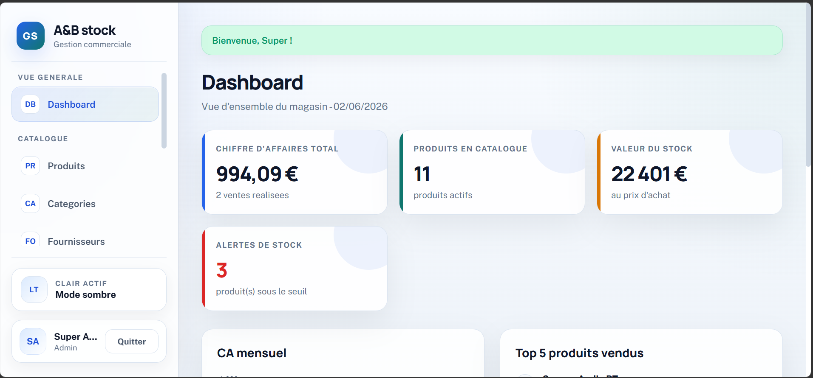

</div>

---

## Table of Contents

- [Features](#features)
- [User Roles](#user-roles)
- [Screenshots](#screenshots)
- [Technologies Used](#technologies-used)
- [Project Architecture](#project-architecture)
- [Main Modules](#main-modules)
- [Security Features](#security-features)
- [Database](#database)
- [Installation](#installation)
- [Project Highlights](#project-highlights)
- [Academic Context](#academic-context)
- [Author](#author)

---

## Features

| Feature | Description |
|---|---|
| Authentication | Secure login and signup system |
| Role-Based Access | Separate access for admin, seller, and supplier |
| Product Management | Add, edit, delete, filter, and search products |
| Category Management | Organize products by category |
| Supplier Management | Manage suppliers and linked accounts |
| User Management | Manage administrators, sellers, and suppliers |
| POS Interface | Add products to cart and validate sales |
| Sales History | Track sales with totals, VAT, status, and details |
| Dashboard Analytics | Revenue, sales count, stock value, and alerts |
| Stock Alerts | Detect products under stock threshold |
| Light / Dark Theme | User interface theme switching |
| Cookie Consent | Access blocked until cookies are accepted |
| Security | CSRF, bcrypt, PDO prepared statements, role checks |

---

## User Roles

### Administrator

The administrator has full access to the system.

Main permissions:

- Manage products
- Manage categories
- Manage suppliers
- Manage users
- Access sales history
- View dashboard statistics
- Configure application settings

### Seller

The seller can manage sales through the POS interface.

Main permissions:

- Search products
- Add products to cart
- Validate sales
- View personal sales history

### Supplier

The supplier has restricted access.

Main permissions:

- View only supplied products
- Check stock information related to their products

---

## Screenshots

### Authentication and Access

<table>
  <tr>
    <td align="center">
      <strong>Cookie Consent</strong><br>
      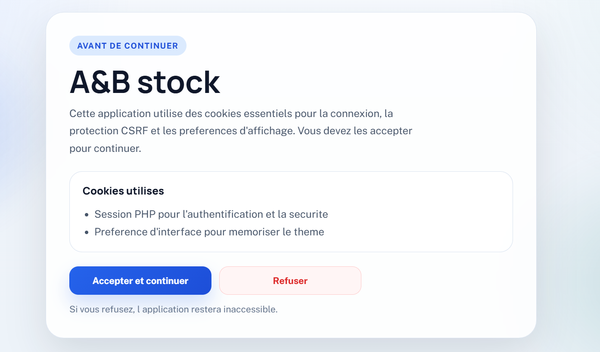
    </td>
  </tr>
</table>

<table>
  <tr>
    <td align="center">
      <strong>Login - Light Mode</strong><br>
      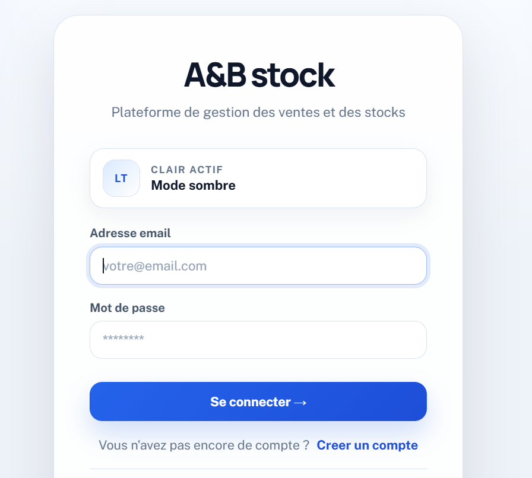
    </td>
    <td align="center">
      <strong>Login - Dark Mode</strong><br>
      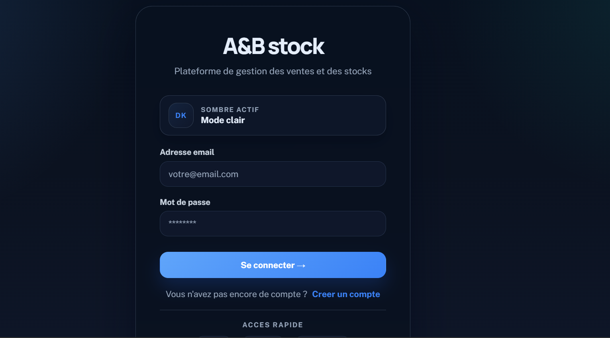
    </td>
  </tr>
</table>

---

### Administrator Interface

<table>
  <tr>
    <td align="center">
      <strong>Admin Dashboard</strong><br>
      
    </td>
  </tr>
</table>

<table>
  <tr>
    <td align="center">
      <strong>Product Management</strong><br>
      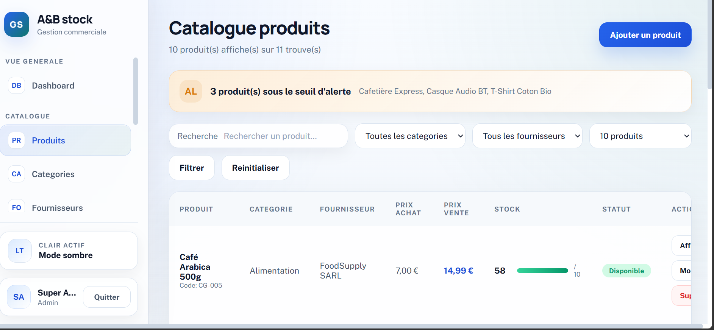
    </td>
    <td align="center">
      <strong>Category Management</strong><br>
      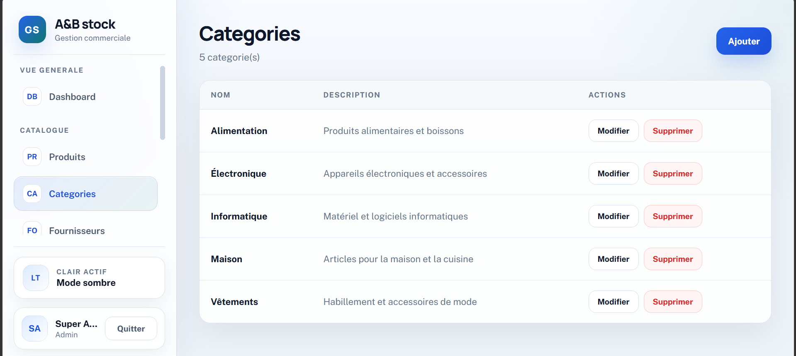
    </td>
  </tr>
</table>

<table>
  <tr>
    <td align="center">
      <strong>Supplier Management</strong><br>
      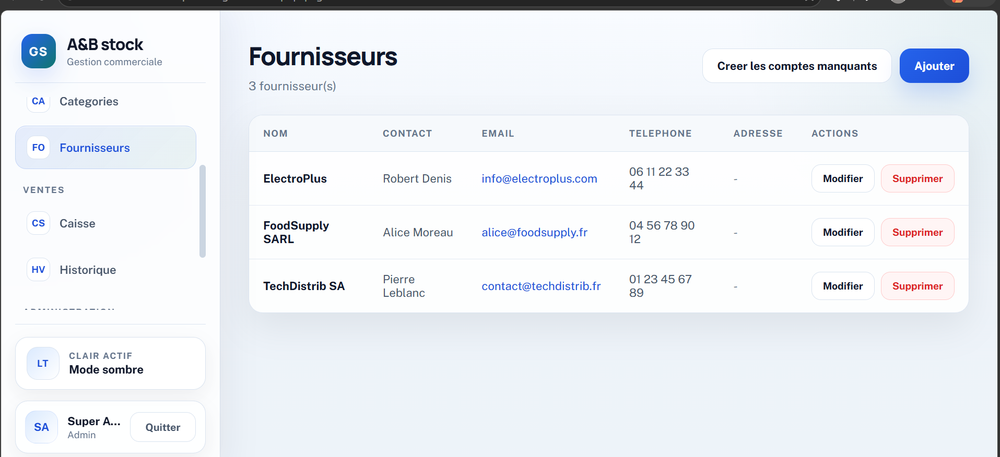
    </td>
    <td align="center">
      <strong>User Management</strong><br>
      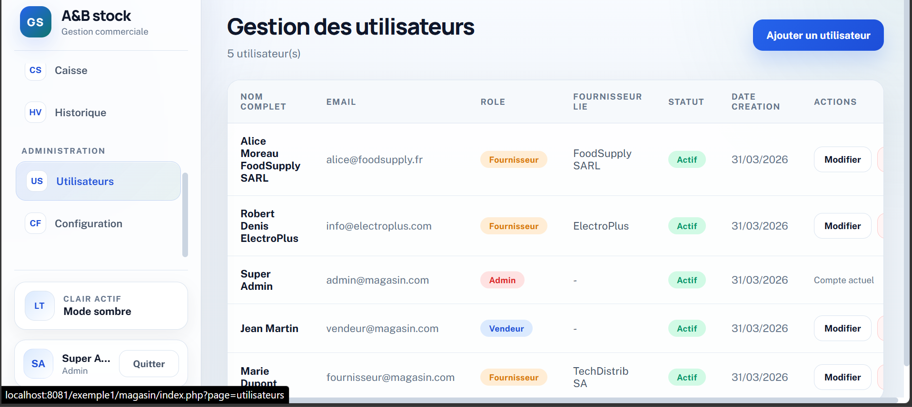
    </td>
  </tr>
</table>

<table>
  <tr>
    <td align="center">
      <strong>Admin POS Interface</strong><br>
      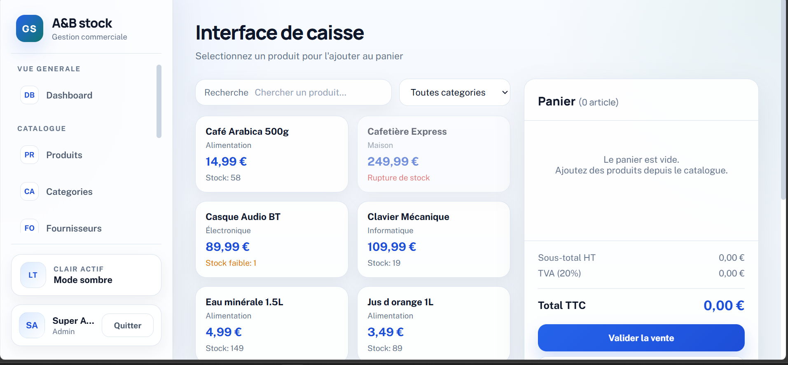
    </td>
    <td align="center">
      <strong>Admin Sales History</strong><br>
      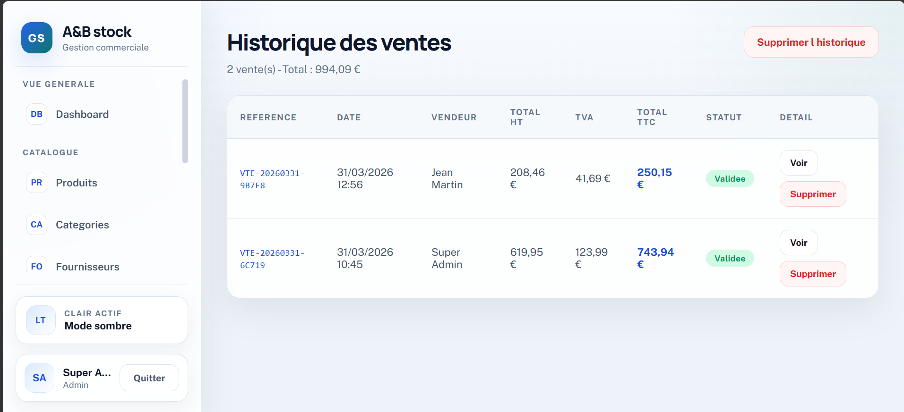
    </td>
  </tr>
</table>

---

### Seller Interface

<table>
  <tr>
    <td align="center">
      <strong>Seller POS Interface</strong><br>
      
    </td>
    <td align="center">
      <strong>Seller Sales History</strong><br>
      
    </td>
  </tr>
</table>

---

### Supplier Interface

<table>
  <tr>
    <td align="center">
      <strong>Supplier Product View</strong><br>
      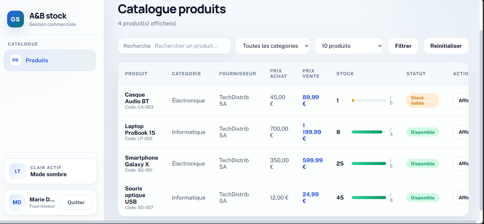
    </td>
  </tr>
</table>

---

## Technologies Used

| Technology | Usage |
|---|---|
| PHP 8 | Backend development |
| MySQL / MariaDB | Database |
| PDO | Secure database access |
| HTML5 | Page structure |
| CSS3 | Styling and responsive UI |
| JavaScript | Dynamic interactions |
| AJAX | Real-time product search and sales validation |
| MVC Architecture | Clean project organization |
| XAMPP | Local development environment |

---

## Project Architecture

The project follows a clean MVC structure:

```text
ab-stock-inventory-system/
├── config/
│   └── Database configuration
│
├── Controleur/
│   └── Controllers for authentication, products, sales, admin actions
│
├── Modele/
│   └── Database models and business logic
│
├── Vue/
│   └── Application views and user interfaces
│
├── public/
│   └── CSS, JavaScript, and public assets
│
├── database/
│   └── SQL database file
│
├── screenshots/
│   └── Project screenshots for documentation
│
└── index.php
    └── Front controller and main router
