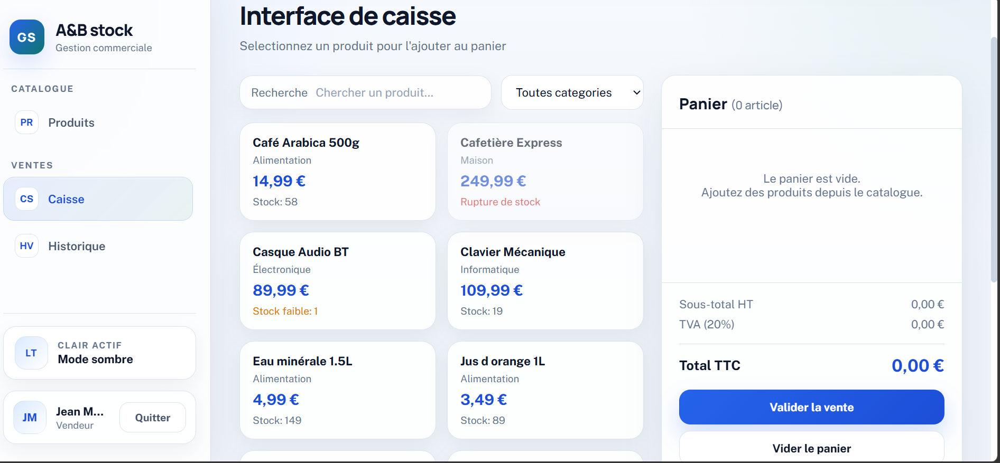
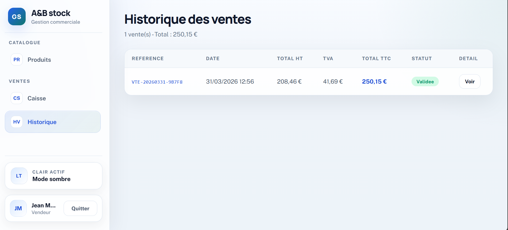

<div align="center">

# A&B Stock  
### POS and Inventory Management System

A professional PHP 8 web application for stock management, sales processing, suppliers, users, and commercial operations.


</div>

---

## Overview

**A&B Stock** is a complete **Point of Sale and Inventory Management System** developed using **PHP 8**, **MySQL**, **PDO**, **JavaScript**, and a structured **MVC architecture**.

The system allows a store to manage products, categories, suppliers, users, sales, stock levels, and dashboard statistics through a clean and modern interface.

The application supports three main user types:

- **Administrator**
- **Vendeur / Seller**
- **Fournisseur / Supplier**

Each user type has a dedicated interface and specific permissions.

---

## Preview

<div align="center">


</div>

---

## Table of Contents

- [Features](#features)
- [User Types](#user-types)
- [Screenshots](#screenshots)
  - [Public and Authentication Screens](#public-and-authentication-screens)
  - [Administrator Screens](#administrator-screens)
  - [Vendeur Screens](#vendeur-screens)
  - [Fournisseur Screens](#fournisseur-screens)
- [Technologies Used](#technologies-used)
- [Project Architecture](#project-architecture)
- [Main Modules](#main-modules)
- [Security Features](#security-features)
- [Database](#database)
- [Installation](#installation)
- [Project Highlights](#project-highlights)
- [Academic Context](#academic-context)
- [Author](#author)

---

## Features

| Feature | Description |
|---|---|
| Authentication | Secure login and signup system |
| Role-Based Access | Different access levels for admin, vendeur, and fournisseur |
| Product Management | Add, update, delete, filter, and search products |
| Category Management | Organize products by category |
| Supplier Management | Manage suppliers and linked supplier accounts |
| User Management | Manage administrators, sellers, and suppliers |
| POS Interface | Add products to cart and validate sales |
| Sales History | Track sales, totals, VAT, status, and sale details |
| Dashboard Analytics | View revenue, stock value, sales count, and stock alerts |
| Stock Alerts | Detect products with low stock |
| Light / Dark Mode | Modern theme switching |
| Cookie Consent | Cookie confirmation before accessing the application |
| Security | CSRF protection, bcrypt hashing, PDO prepared statements, and role checks |

---

## User Types

### Administrator

The administrator has full access to the application.

Main permissions:

- Manage products
- Manage categories
- Manage suppliers
- Manage users
- Access the POS interface
- View complete sales history
- View dashboard statistics
- Manage application settings

### Vendeur / Seller

The vendeur is responsible for sales operations.

Main permissions:

- Access the POS interface
- Search products
- Add products to cart
- Validate sales
- View personal sales history

### Fournisseur / Supplier

The fournisseur has limited access to stock information.

Main permissions:

- View supplied products
- Check stock quantities
- Access only products linked to their supplier account

---

# Screenshots

## Public and Authentication Screens

These screens are accessible before entering the role-based areas of the application.

<table>
  <tr>
    <td align="center">
      <strong>Cookie Consent</strong><br><br>
      
    </td>
  </tr>
</table>

<table>
  <tr>
    <td align="center">
      <strong>Login - Light Mode</strong><br><br>
      
    </td>
    <td align="center">
      <strong>Login - Dark Mode</strong><br><br>
      
    </td>
  </tr>
</table>

---

## Administrator Screens

The administrator interface provides complete control over the system, including stock, products, users, suppliers, sales, and statistics.

### Admin Dashboard

<table>
  <tr>
    <td align="center">
      
    </td>
  </tr>
</table>

### Product and Category Management

<table>
  <tr>
    <td align="center">
      <strong>Product Management</strong><br><br>
      
    </td>
    <td align="center">
      <strong>Category Management</strong><br><br>
      
    </td>
  </tr>
</table>

### Supplier and User Management

<table>
  <tr>
    <td align="center">
      <strong>Supplier Management</strong><br><br>
      
    </td>
    <td align="center">
      <strong>User Management</strong><br><br>
      
    </td>
  </tr>
</table>

### Admin Sales Operations

<table>
  <tr>
    <td align="center">
      <strong>Admin POS Interface</strong><br><br>
      
    </td>
    <td align="center">
      <strong>Admin Sales History</strong><br><br>
      
    </td>
  </tr>
</table>

---

## Vendeur Screens

The vendeur interface is focused on sales operations and personal sales tracking.

<table>
  <tr>
    <td align="center">
      <strong>Vendeur POS Interface</strong><br><br>
      
    </td>
  </tr>
</table>

<table>
  <tr>
    <td align="center">
      <strong>Vendeur Sales History</strong><br><br>
      
    </td>
  </tr>
</table>

## Fournisseur Screens

The fournisseur interface gives access only to the products and stock information related to that supplier.

<table>
  <tr>
    <td align="center">
      <strong>Fournisseur Product View</strong><br><br>
      
    </td>
  </tr>
</table>

---

## Technologies Used

| Technology | Usage |
|---|---|
| PHP 8 | Backend development |
| MySQL / MariaDB | Database management |
| PDO | Secure database access |
| HTML5 | Page structure |
| CSS3 | Styling and responsive design |
| JavaScript | Dynamic interface behavior |
| AJAX | Real-time product search and sale validation |
| MVC Architecture | Clean project organization |
| XAMPP | Local development environment |

---

## Project Architecture

The project follows a clean MVC structure:

```text
ab-stock-inventory-system/
├── config/
│   └── Database configuration
│
├── Controleur/
│   └── Controllers for authentication, products, sales, and admin actions
│
├── Modele/
│   └── Database models and business logic
│
├── Vue/
│   └── Application views and user interfaces
│
├── public/
│   └── CSS, JavaScript, and public assets
│
├── database/
│   └── SQL database file
│
├── screenshots/
│   └── Project screenshots
│
└── index.php
    └── Front controller and main router
